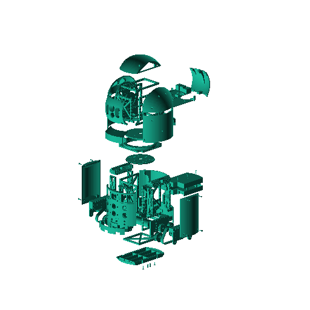

Introduction
============

Homebot is an affordable open source home-built robot designed for experimentation.

This project is in beta status. Much of the documentation is incomplete.

#Disclaimer

This package is free software; the copyright holder gives unlimited permission to copy and/or distribute it, with or without modifications, as long as this notice is preserved. This package is distributed in the hope that it will be useful, but WITHOUT ANY WARRANTY, to the extent permitted by law; without even the implied warranty of MERCHANTABILITY or FITNESS FOR A PARTICULAR PURPOSE. Some information described herein may be potentially dangerous if misused. Follow these instructions are your own risk.

#Philosophy

This project has been constructed with the following philosophies in mind:

1. Openness
 
    There are several other "open source" robotics projects, but most only open source some of the software. Usually, large portions of the software are propreitary and most, if not all, of the hardware is proprietary. All of this project's software is open source and uses [ROS](http://www.ros.org/) as the framework. Most of the hardware is open source as well. The CAD files for all structural components are provided, and the core electronics are based on open hardware like the Raspberry Pi and Arduino. However, due to time and resource constraints, some propreitary off-the-shelf components were used.  

2. Modularity

    The mechanical design is based on modular components attached to a basic skeleton. Parts can be swapped out or redesigned and replaced without necessarily redesigning other components. 

#Features

The default hardware configuration is composed of:

* 1 Raspberry Pi 3 functioning as the main computer
* 2 Arudino microcontrollers for IO expansion and handling

Sensors include:

* 3 edge/cliff sensors
* 3 contact/bumper sensors
* 3 ultrasonic range finders
* 1 IMU (combined acclerometer, gyroscope and magnetometer)
* 2 microphones
* 1 5MP camera configured as a laser range finder with a functional distance of 3 meters
* 2 temperature sensors

A simple web-based user-interface is provided for operating the robot remotely and monitoring system status.

#Prerequisites

Although great effort has been made to make these instructions clear and the design as simple as possible, constructing a robot is complicated and requires a wide breadth of knowledge. This documentation assumes you have basic experience in:

* Mechanics

    You should have an understanding of basic physics, as well as how to assemble simple mechanical components. If you passed highschool physics and can assemble Ikea furniture, you should be set.  

* Electronics

    You should be able to read basic electricial circuit schematics, and how to wire, solder and etch simple circuit boards.  

* Software

    You should have an intermediate understanding of Python and C programming as well as basic network, database and Linux systems adminstration.  

#Onward!

1. [Allocate the appropriate tools](tools.md)
2. [Allocate the appropriate parts and supplies](parts.md)
3. [Setup your work environment](setup.md)
4. [Fabricate and assemble the hardware](hardware.md)
5. [Configure and test the software](software.md)
6. [Experiment](experiment.md)

